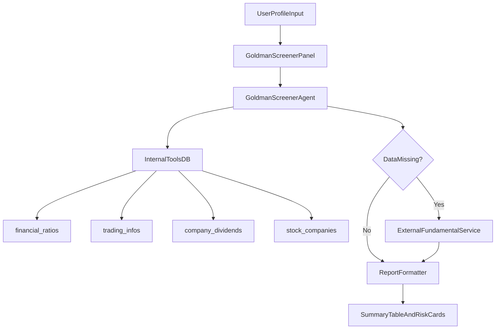

# Rencana Implementasi Goldman Screener Agent

## Tujuan

Menyediakan fitur `AI Screener` yang menghasilkan report screening profesional (top 10 saham + metrik valuasi/fundamental/risk/price target) berdasarkan profil investasi user, dalam halaman terpisah dan UI yang lebih terstruktur dari chat biasa.

## Keputusan Arsitektur

- **Penempatan fitur**: halaman baru dengan route + menu terpisah (sesuai pilihanmu), bukan ditanam di halaman existing.
- **Strategi data**: hybrid.
  - Prioritas data internal (`financial_ratios`, `trading_infos`, `company_dividends`, `stock_companies`).
  - Fallback ke sumber eksternal saat metrik tidak tersedia/kurang lengkap.
- **Output agent**: tetap naratif, namun dipaksa menghasilkan format report yang konsisten + summary table siap render di UI.

## Perubahan File yang Direncanakan

- Tambah agent baru: `[d:\project\bandar-saham\bandar-saham\app\Neuron\Agents\GoldmanScreenerAgent.php](d:\project\bandar-saham\bandar-saham\app\Neuron\Agents\GoldmanScreenerAgent.php)`
- Tambah panel Livewire: `[d:\project\bandar-saham\bandar-saham\app\Livewire\Screening\GoldmanScreenerPanel.php](d:\project\bandar-saham\bandar-saham\app\Livewire\Screening\GoldmanScreenerPanel.php)`
- Tambah view report UI: `[d:\project\bandar-saham\bandar-saham\resources\views\livewire\screening\goldman-screener-panel.blade.php](d:\project\bandar-saham\bandar-saham\resources\views\livewire\screening\goldman-screener-panel.blade.php)`
- Registrasi route halaman baru: `[d:\project\bandar-saham\bandar-saham\routes\web.php](d:\project\bandar-saham\bandar-saham\routes\web.php)`
- Tambah item menu sidebar/header: `[d:\project\bandar-saham\bandar-saham\resources\views\layouts\app\sidebar.blade.php](d:\project\bandar-saham\bandar-saham\resources\views\layouts\app\sidebar.blade.php)`, `[d:\project\bandar-saham\bandar-saham\resources\views\layouts\app\header.blade.php](d:\project\bandar-saham\bandar-saham\resources\views\layouts\app\header.blade.php)`
- Tambah permission baru: `[d:\project\bandar-saham\bandar-saham\database\seeders\PermissionSeeder.php](d:\project\bandar-saham\bandar-saham\database\seeders\PermissionSeeder.php)`
- (Opsional fallback API) service connector baru + config env:
  - `[d:\project\bandar-saham\bandar-saham\app\Services\Screening\ExternalFundamentalService.php](d:\project\bandar-saham\bandar-saham\app\Services\Screening\ExternalFundamentalService.php)`
  - `[d:\project\bandar-saham\bandar-saham\config\services.php](d:\project\bandar-saham\bandar-saham\config\services.php)`
  - `[d:\project\bandar-saham\bandar-saham\.env.example](d:\project\bandar-saham\bandar-saham\.env.example)`

## Desain Fungsional Agent

- Agent menerima profil investasi user:
  - risk tolerance, amount, time horizon, preferred sectors.
- Agent mengembalikan report dengan struktur wajib:
  - top 10 picks + ticker
  - P/E vs sector average
  - revenue growth 5Y
  - debt-to-equity health
  - dividend yield + payout sustainability score
  - moat rating (weak/moderate/strong)
  - bull vs bear 12-month target
  - risk rating 1-10 + reasoning
  - entry zone + stop-loss
- Agent akan menggunakan tool internal terstruktur (bukan tebak data), lalu fallback ke external service jika field tidak cukup.

## Rekomendasi UI (Agar Menarik dan Praktis)

- Halaman baru dengan 2 area:
  - Form profil investasi (slider risk, nominal dana, horizon, sektor preferensi).
  - Hasil report dalam kartu + summary table + badge rating warna.
- Tombol cepat:
  - `Generate Report`, `Regenerate`, `Export Markdown` (opsional tahap 2: PDF).
- Riwayat report per user (thread terpisah seperti agent lain) untuk membandingkan hasil screening antar waktu.

## Alur Data

## Tahap Implementasi

1. Buat permission + route + menu `AI Screener` terpisah.
2. Implement Livewire panel baru dengan input profil investasi dan state report.
3. Implement `GoldmanScreenerAgent` + tool query internal untuk semua metrik wajib.
4. Tambahkan fallback external service untuk metrik yang belum lengkap.
5. Render hasil dalam format report profesional (table + sections terstandar).
6. Uji skenario data lengkap vs data parsial, lalu harden handling missing-data.

## Catatan Penting

- Karena output mencakup proyeksi 12 bulan, agent akan diminta menulis asumsi secara eksplisit agar reasoning transparan.
- Jika fallback API belum diset, sistem tetap jalan full internal dan memberi disclaimer coverage data.

