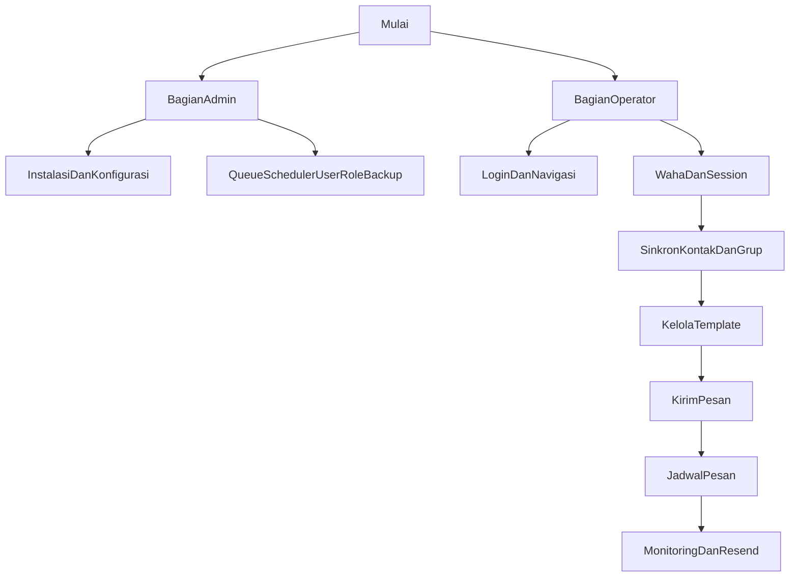

# Rencana Manual Penggunaan

## Tujuan
Membuat dokumen Markdown manual penggunaan aplikasi yang fokus pada pemakaian nyata sistem broadcast WhatsApp ini, dibagi menjadi dua bagian:
- Admin: instalasi, konfigurasi dasar, WAHA, queue/scheduler, user/role, backup-restore.
- Operator: login, pengenalan menu, pengelolaan session, sinkronisasi kontak/grup, template, kirim pesan, jadwal, pemantauan status.

## Sumber Acuan Utama
Manual akan diturunkan dari file berikut agar isinya sesuai aplikasi saat ini:
- [README.md](D:/project/broadcast/README.md) untuk instalasi, requirement, queue, scheduler, dan gambaran fitur.
- [routes/web.php](D:/project/broadcast/routes/web.php) untuk peta halaman yang benar-benar tersedia.
- [resources/views/layouts/app/sidebar.blade.php](D:/project/broadcast/resources/views/layouts/app/sidebar.blade.php) untuk struktur menu yang dilihat pengguna.
- [app/Livewire/Broadcast/Messages/MesssagesIndex.php](D:/project/broadcast/app/Livewire/Broadcast/Messages/MesssagesIndex.php) untuk alur kirim pesan, tipe penerima, bulk upload, status, dan resend.
- [app/Livewire/Sessions/SessionsIndex.php](D:/project/broadcast/app/Livewire/Sessions/SessionsIndex.php) untuk perilaku daftar session dan ketergantungan WAHA.
- [app/Livewire/Schedules/SchedulesCreate.php](D:/project/broadcast/app/Livewire/Schedules/SchedulesCreate.php) untuk alur pembuatan jadwal dan tipe penerima.
- [docs/SCHEDULE_USAGE.md](D:/project/broadcast/docs/SCHEDULE_USAGE.md) untuk detail operasional scheduler.
- [API_DOCUMENTATION.md](D:/project/broadcast/API_DOCUMENTATION.md) hanya sebagai referensi lampiran bila diperlukan, bukan inti manual operator.

## Struktur Manual Yang Akan Ditulis
1. Ringkasan aplikasi dan tujuan penggunaan.
2. Prasyarat sistem dan komponen pendukung.
3. Bagian Admin:
- instalasi aplikasi
- konfigurasi environment dan database
- konfigurasi WAHA
- menjalankan queue worker
- mengaktifkan scheduler
- membuat user/role dan hak akses
- backup dan restore
- troubleshooting dasar
4. Bagian Operator:
- login dan navigasi menu
- urutan penggunaan yang direkomendasikan: WAHA -> Sessions -> Contacts/Groups -> Templates -> Messages -> Schedules -> Monitoring
- cara kirim pesan langsung, template, file, gambar, dan bulk upload
- cara membuat dan mengelola jadwal
- cara membaca status pending/sent/failed dan resend pesan gagal
5. FAQ singkat dan catatan operasional.

## Pendekatan Penulisan
- Gunakan bahasa Indonesia yang langsung dan instruksional.
- Pisahkan jelas langkah Admin dan Operator agar tidak tercampur.
- Prioritaskan alur yang tampak di menu/sidebar, bukan daftar fitur generik di README.
- Tandai inkonsistensi dokumentasi lama bila ada, misalnya perbedaan versi Laravel di README vs dependensi proyek, tanpa membuat manual jadi membingungkan.
- Jika tidak ada screenshot di repo, gunakan langkah berbasis menu dan nama tombol/halaman.

## Alur Dokumen

## Output
Dokumen Markdown baru di repo, kemungkinan bernama `docs/MANUAL_PENGGUNAAN.md` atau nama setara, dengan daftar isi yang bisa langsung dipakai pengguna internal.