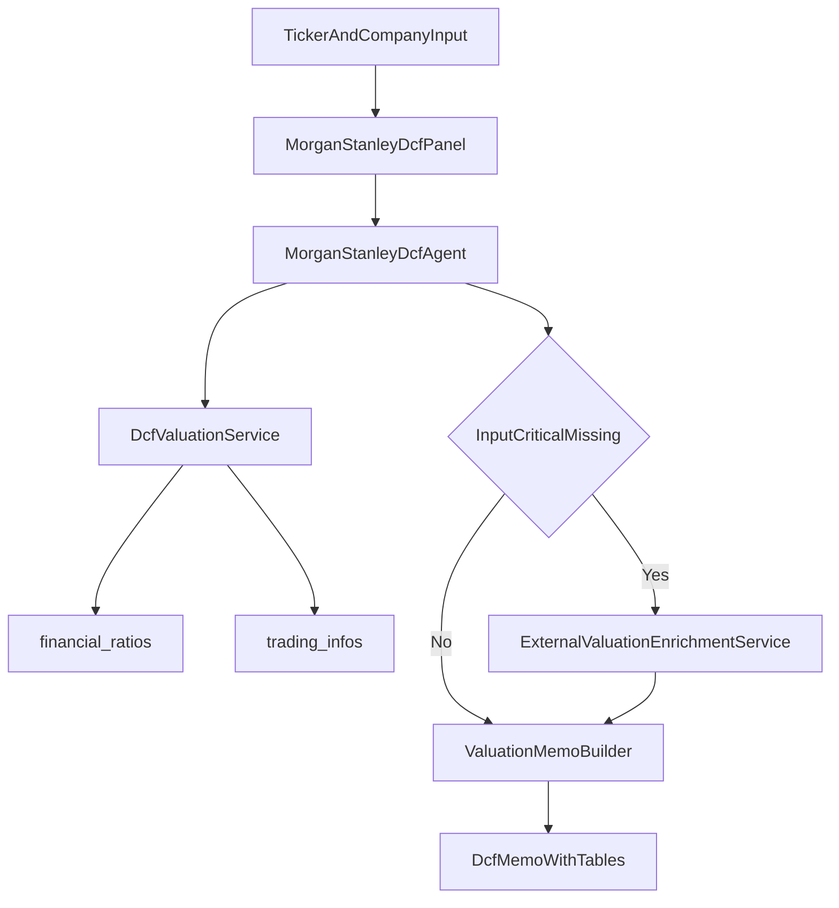

# Rencana Implementasi Morgan Stanley DCF Agent

## Tujuan

Menyediakan fitur baru `AI Valuation` yang menghasilkan memo valuasi DCF bergaya investment banking untuk satu saham spesifik (ticker + nama perusahaan), lengkap dengan tabel proyeksi, asumsi, sensitivitas, dan verdict valuasi.

## Keputusan Implementasi

- Penempatan: **menu terpisah** (halaman Livewire sendiri), konsisten dengan pola `AI Screener`.
- Strategi data: **hybrid internal+external**.
  - Internal dipakai untuk histori finansial (`financial_ratios`), harga & saham beredar (`trading_infos`), benchmark sektor.
  - External dipakai untuk enrichment saat input kritis DCF kurang (terutama asumsi WACC/market metrics).
- Output agent: memo profesional berbahasa Indonesia dengan tabel dan math yang eksplisit.

## Keterbatasan Data dan Pendekatan DCF

Data internal belum punya komponen FCFF penuh (CFO, capex, perubahan modal kerja). Maka engine akan menggunakan pendekatan **model DCF berbasis proxy yang transparan**:

- Revenue projection 5Y dari histori `sales` + asumsi growth.
- Margin dari histori (pakai `npm`/profit trend sebagai basis operating/earnings proxy).
- FCF dihitung dari proxy formula yang dijelaskan eksplisit di laporan.
- WACC default dihitung dari parameter internal + asumsi; jika tersedia, diperkaya data eksternal.
- Terminal value pakai dua metode: perpetuity growth dan exit multiple.
- Seluruh asumsi yang dapat “break the model” ditampilkan jelas di akhir memo.

## File yang Akan Ditambah/Diubah

- Agent baru: [d:\project\bandar-saham\bandar-saham\app\Neuron\Agents\MorganStanleyDcfAgent.php](d:\project\bandar-saham\bandar-saham\app\Neuron\Agents\MorganStanleyDcfAgent.php)
- Service kalkulasi DCF internal: [d:\project\bandar-saham\bandar-saham\app\Services\Valuation\DcfValuationService.php](d:\project\bandar-saham\bandar-saham\app\Services\Valuation\DcfValuationService.php)
- Service enrichment eksternal valuation: [d:\project\bandar-saham\bandar-saham\app\Services\Valuation\ExternalValuationEnrichmentService.php](d:\project\bandar-saham\bandar-saham\app\Services\Valuation\ExternalValuationEnrichmentService.php)
- Livewire panel: [d:\project\bandar-saham\bandar-saham\app\Livewire\Valuation\MorganStanleyDcfPanel.php](d:\project\bandar-saham\bandar-saham\app\Livewire\Valuation\MorganStanleyDcfPanel.php)
- View panel: [d:\project\bandar-saham\bandar-saham\resources\views\livewire\valuation\morgan-stanley-dcf-panel.blade.php](d:\project\bandar-saham\bandar-saham\resources\views\livewire\valuation\morgan-stanley-dcf-panel.blade.php)
- Route: [d:\project\bandar-saham\bandar-saham\routes\web.php](d:\project\bandar-saham\bandar-saham\routes\web.php)
- Sidebar/header menu: [d:\project\bandar-saham\bandar-saham\resources\views\layouts\app\sidebar.blade.php](d:\project\bandar-saham\bandar-saham\resources\views\layouts\app\sidebar.blade.php), [d:\project\bandar-saham\bandar-saham\resources\views\layouts\app\header.blade.php](d:\project\bandar-saham\bandar-saham\resources\views\layouts\app\header.blade.php)
- Permission seeder: [d:\project\bandar-saham\bandar-saham\database\seeders\PermissionSeeder.php](d:\project\bandar-saham\bandar-saham\database\seeders\PermissionSeeder.php) (+ optional dedicated seeder seperti pola `AiScreenerPermissionSeeder`)
- Config/env eksternal: [d:\project\bandar-saham\bandar-saham\config\services.php](d:\project\bandar-saham\bandar-saham\config\services.php), [d:\project\bandar-saham\bandar-sahamenv.example](d:\project\bandar-saham\bandar-saham.env.example)
- Feature test akses halaman baru: [d:\project\bandar-saham\bandar-saham\tests\Feature\AiValuationDcfTest.php](d:\project\bandar-saham\bandar-saham\tests\Feature\AiValuationDcfTest.php)

## Desain Tooling Agent (Ringkas)

- `get_emiten_history_for_dcf(code)` → histori sales/profit/margin/DER + harga terbaru.
- `build_dcf_projection(code, growth_scenario, margin_scenario, wacc_assumption, terminal_assumption)` → tabel 5Y, FCF proxy, PV, TV dual-method.
- `run_dcf_sensitivity(code, wacc_range, terminal_growth_range, exit_multiple_range)` → matrix sensitivitas fair value.
- `enrich_market_inputs(code)` → fallback eksternal untuk harga/metric bila data internal tidak cukup.

## Alur Utama

## Tahapan Implementasi

1. Tambah permission, route, dan menu `AI Valuation`.
2. Buat panel Livewire + UI input (ticker, nama perusahaan, asumsi opsional) dan area hasil memo berscroll.
3. Implement service DCF internal (proyeksi, FCF proxy, WACC estimator, TV dual-method, sensitivitas).
4. Implement agent Neuron dengan guardrail anti-hallucination + format memo baku.
5. Tambah enrichment eksternal + konfigurasi env untuk melengkapi asumsi market.
6. Tambah test akses halaman + verifikasi render memo untuk skenario data parsial/lengkap.

## Kriteria Selesai

- User bisa membuka menu `AI Valuation`, mengisi ticker, dan menghasilkan memo DCF lengkap.
- Output memuat seluruh komponen yang diminta user (revenue 5Y, margin, FCF, WACC, TV dual-method, sensitivitas, banding harga pasar, verdict, key risks).
- Saat data kurang, output tetap jalan dengan fallback atau disclaimer eksplisit (tanpa angka fiktif).

