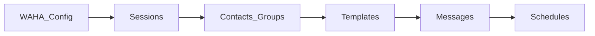

# Manual Operator / Pengguna — Broadcast

Dokumen ini untuk **pengguna akhir** yang login ke aplikasi web untuk mengonfigurasi WAHA (jika diberi akses), mengelola sesi, kontak, grup, template, mengirim pesan, dan jadwal. Untuk **instalasi server, queue, cron, dan manajemen peran**, gunakan [MANUAL_ADMIN.md](MANUAL_ADMIN.md).

---

## Daftar isi

1. [Apa itu Broadcast](#1-apa-itu-broadcast)
2. [Sebelum memulai](#2-sebelum-memulai)
3. [Masuk, keluar, dan pengaturan akun](#3-masuk-keluar-dan-pengaturan-akun)
4. [Navigasi menu](#4-navigasi-menu)
5. [Alur kerja yang disarankan](#5-alur-kerja-yang-disarankan)
6. [Panduan per fitur](#6-panduan-per-fitur)
7. [Status pesan, jadwal, dan kirim ulang](#7-status-pesan-jadwal-dan-kirim-ulang)
8. [Menu tidak muncul?](#8-menu-tidak-muncul)
9. [FAQ pengguna](#9-faq-pengguna)
10. [Referensi](#10-referensi)

---

## 1. Apa itu Broadcast

**Broadcast** membantu Anda mengelola **WhatsApp** lewat **WAHA** (WhatsApp HTTP API): sesi WhatsApp, sinkron kontak/grup, template pesan, pengiriman pesan (teks, gambar, file, pratinjau tautan), kampanye massal dari file Excel/CSV, dan **jadwal berulang** (harian/mingguan/bulanan). Status pengiriman ditampilkan sebagai **pending**, **sent**, atau **failed**.

---

## 2. Sebelum memulai

- Anda membutuhkan **akun** yang dibuat admin (atau daftar mandiri jika dibuka).
- **Browser** modern; untuk pengalaman terbaik gunakan layar yang cukup lebar (desktop).
- Pastikan tim **admin** sudah menjalankan **antrian** dan **jadwal server** bila Anda mengirim pesan atau memakai jadwal otomatis — jika tidak, pesan bisa tertahan (lihat admin jika ragu).

---

## 3. Masuk, keluar, dan pengaturan akun

| Tindakan | Lokasi |
|----------|--------|
| Login | `/login` |
| Daftar (jika dibuka) | `/register` |
| Lupa password | `/forgot-password` |
| Keluar | Menu profil → **Log Out** |
| Dashboard | `/` atau `/dashboard` |

**Settings** (menu profil):

- **Profile** — nama, email, **zona waktu** (penting untuk jam tampilan dan jadwal).
- **Password** — ganti kata sandi.
- **Appearance** — tampilan antarmuka.

Anda dapat mengganti tema **terang/gelap** dari sidebar (bagian **Theming**).

---

## 4. Navigasi menu

Menu di **sidebar** hanya muncul jika Anda punya **izin** yang sesuai.

| Grup | Isi |
|------|-----|
| **Dashboard** | Ringkasan aktivitas dan statistik |
| **Setup** | **Company**, **WAHA Configuration** |
| **Access Control** | **Users**, **Roles** (biasanya untuk admin/pimpinan) |
| **List** | **Sessions**, **Contacts**, **Groups**, **Templates** |
| **Broadcast** | **Messages**, **Schedules** |
| **Tool** | **Backup and Restore**, **About** |

Di ponsel, buka menu lewat ikon **hamburger**.

---

## 5. Alur kerja yang disarankan

1. **WAHA Configuration** — isi URL dan API Key, pastikan status terhubung.
2. **Sessions** — buat/daftarkan sesi WhatsApp; hubungkan (scan QR di WAHA bila perlu).
3. **Contacts** / **Groups** — sinkronkan dari WhatsApp untuk sesi yang dipakai.
4. **Templates** — buat template dengan variabel jika sering memakai format sama.
5. **Messages** — kirim pesan atau kampanye bulk.
6. **Schedules** — atur pengiriman berulang jika perlu.
7. Pantau **Dashboard** dan **Messages**.

---

## 6. Panduan per fitur

### 6.1 Company

Menampilkan atau mengedit informasi perusahaan (`/company`, `/company/edit`) — sesuai izin Anda.

### 6.2 WAHA Configuration (`/waha`)

- Isi **URL API** (biasanya `https://...`) dan **API Key**.
- Simpan; sistem biasanya mengecek koneksi.
- Tanpa ini, banyak fitur menampilkan peringatan atau menolak.

### 6.3 Sessions (`/sessions`)

- Daftar menggabungkan data **WAHA** dengan sesi di **database milik Anda**.
- Hanya sesi yang **terdaftar di aplikasi** dan cocok dengan nama di WAHA yang tampil lengkap dengan status.
- Anda dapat membuat, mengubah, melihat, atau menghapus sesi (sesuai izin). Penghapusan juga menghapus sesi di sisi WAHA.
- Gunakan **clear cache** jika data perlu dimuat ulang.

### 6.4 Contacts (`/contacts`) dan Groups (`/groups`)

- **Sinkronkan** kontak/grup dari WhatsApp (tombol sesuai layar; perlu izin `contact.sync` / `group.sync`).
- Filter dan cari per sesi; buka detail untuk informasi lengkap.

### 6.5 Templates (`/templates`)

- Membuat template butuh WAHA sudah dikonfigurasi.
- **Nama template**: hanya huruf kecil dan garis bawah, contoh: `promo_bulan_ini`.
- **Header** (opsional), maks. 60 karakter; **body** (wajib), maks. 1024 karakter.
- Variabel: **`{{nama_variabel}}`** di header/body (contoh: `{{nama}}`).

### 6.6 Messages (`/messages`)

- Pastikan **status WAHA** terhubung sebelum kirim besar.
- Di modal kirim: pilih **sesi** WhatsApp — kontak/grup mengikuti sesi tersebut.
- **Direct**: teks, gambar, file, atau **custom** (pratinjau tautan: judul, deskripsi, gambar).
- **Template**: pilih template aktif **milik Anda**; isi parameter `{{...}}`.
- **Penerima**: nomor manual, **contact**, **group**, atau **bulk** (Excel/CSV) — gunakan **unduh template** di aplikasi untuk format kolom.
- **Kirim sekarang** atau **jadwal sekali** — waktu mengikuti **zona waktu** profil Anda; jadwal "nanti" biasanya minimal beberapa menit dari sekarang.
- **Daftar pesan**: filter, urutkan, lihat status; **kirim ulang** hanya untuk pesan **failed**.

### 6.7 Schedules (`/schedules`)

- Buat jadwal: sesi, nama, deskripsi, isi pesan, tipe penerima (kontak / grup / nomor), frekuensi **harian / mingguan / bulanan**, waktu, dan hari (untuk mingguan/bulanan).
- Beberapa penerima didukung dalam satu jadwal.
- Agar jadwal otomatis jalan, **server** harus menjalankan cron dan antrian — hubungi admin jika jadwal tidak pernah terkirim.

### 6.8 Audit

Beberapa modul punya halaman **audit** untuk riwayat aktivitas — jika Anda punya izin `*.audit`.

### 6.9 About

Informasi tentang aplikasi.

---

## 7. Status pesan, jadwal, dan kirim ulang

| Yang Anda lihat | Apa artinya / apa yang dilakukan |
|-----------------|-----------------------------------|
| **pending** | Pesan masih antri; tunggu. Jika lama, tanyakan admin apakah **queue worker** berjalan. |
| **sent** | Terkirim. |
| **failed** | Gagal; Anda bisa coba **kirim ulang** dari aplikasi jika tersedia. Periksa juga nomor dan koneksi WAHA. |
| Jadwal tidak pernah jalan | Hubungi **admin** — biasanya perlu pengaturan cron dan antrian di server. |

---

## 8. Menu tidak muncul?

Menu disembunyikan jika Anda **tidak punya izin** untuk fitur tersebut. Minta **admin** menyesuaikan **Role** dan izin di aplikasi.

---

## 9. FAQ pengguna

**T: Template tidak muncul saat kirim?**  
J: Template harus **aktif** dan dibuat oleh **user yang sama** (akun Anda). Pilih sesi yang benar.

**T: Bulk upload ditolak?**  
J: Periksa format (Excel/CSV), ukuran file, dan isi baris (nomor + pesan atau kolom template).

**T: Pratinjau tautan (custom) gagal?**  
J: URL di teks pesan harus **identik** dengan **Preview URL**.

**T: Pesan tidak pernah terkirim?**  
J: Cek status WAHA; jika masih pending, hubungi admin untuk **queue worker**.

---

## 10. Referensi

| Dokumen | Isi |
|---------|-----|
| [MANUAL_ADMIN.md](MANUAL_ADMIN.md) | Instalasi, queue, cron, peran, backup |
| [README.md](../README.md) | Instalasi detail, contoh format CSV |
| [SCHEDULE_USAGE.md](SCHEDULE_USAGE.md) | Cara kerja jadwal di server |

---

*Panduan ini untuk penggunaan antarmuka. Konfigurasi infrastruktur di [MANUAL_ADMIN.md](MANUAL_ADMIN.md).*
